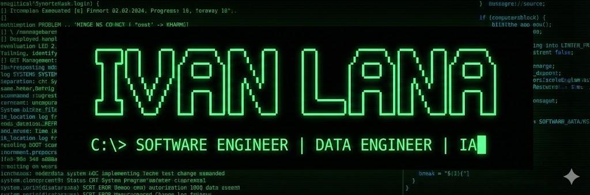

# Hey, my name is **Ivan Lana**

💼 **Software Engineer**  
🔹 Backend | Data Engineering | Cloud | Applied AI  
🔹 .NET | Python | SQL | React | Angular  

I develop **scalable systems, APIs, data pipelines and intelligent solutions**, using AI to automate processes and generate real business value.

I focus on **architecture, clean code, performance and the practical use of AI in day-to-day development**.

---

## 🚀 Main Stack

### 💻 Backend

C# .NET • Python • FastAPI • REST APIs • Microservices • MVC

---

### 🌐 Frontend

React • Angular • TypeScript • JavaScript

---

### 📊 Data

SQL/PLSQL • PostgreSQL • Pandas • ETL • Data modeling • Pipelines

---

### 🤖 AI & Automation

Integration with LLMs • Prompt Engineering • Data analysis • Task automation • AI applied to systems

---

### ☁️ Cloud & DevOps

Azure • Docker • Git • Linux • CI/CD

---

## 📌 Featured Projects

### 🧠 Palo Analyzer
🔗 https://github.com/Iv4nLanna/Palo-Analyzer  

Python system for **automated analysis of the Palographic Test**, using classical computer vision, auditable rules, and a desktop interface.

**Stack:** Python • OpenCV • NumPy • Scikit-learn • Tkinter • GitHub Actions

🚐 Best Route
🔗 https://github.com/Iv4nLanna/best-Route

SaaS platform for daily school-van route optimization, with one-click planning, student status tracking, manual stop reordering (drag-and-drop), ETA per stop, and operational/financial impact metrics.

**Stack:** FastAPI • SQLAlchemy • Next.js • TypeScript • Tailwind CSS • SQLite/PostgreSQL • OpenRouteService • Docker • Pytest

---

## 🎯 Focus
**Software Engineering • Data Engineering • Cloud Systems • Distributed Architectures • AI**

---

## 📫 Contact
💼 LinkedIn: https://www.linkedin.com/in/ivan-lana/  
📧 Email: ivanlana2000@gmail.com

